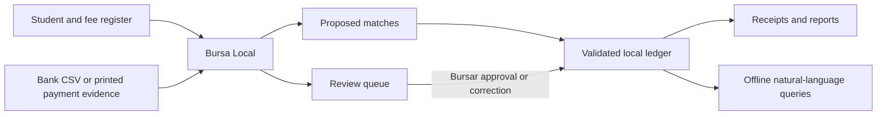
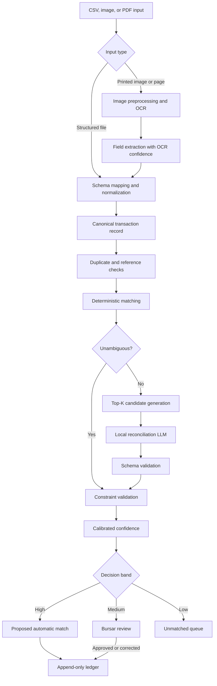
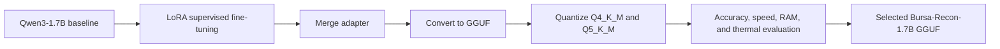

# Bursa Local Model Architecture

**Document status:** Approved design baseline  
**Last updated:** 23 July 2026  
**Primary reader:** Bursa product and engineering team, including Fikayo  
**Hackathon track:** Corporate / Enterprise  
**Deployment target:** ADTC Standard Laptop — Ubuntu 22.04, Intel Core i5, 8 GB RAM, integrated graphics, no discrete GPU

## 1. Executive Summary

Bursa is an offline AI reconciliation copilot for African schools. It converts bank statements, printed receipts, teller slips, transfer screenshots, and student fee records into proposed payment allocations and an auditable student-fee ledger.

The architecture is deliberately hybrid:

- Deterministic rules resolve obvious transactions cheaply and safely.
- A locally running language model interprets ambiguous narrations and ranks plausible students.
- A financial constraint engine validates every proposed allocation.
- A bursar reviews uncertain cases before they enter the ledger.
- OCR is a secondary ingestion method for printed payment evidence.

The language model is load-bearing for ambiguous reconciliation, but it never writes directly to the ledger. This boundary provides the benefits of language understanding without allowing generated text to become an unverified financial record.

## 2. Architecture Goals

The architecture must:

1. Run completely offline during inference.
2. Remain comfortably below the competition's 7 GB peak-RAM disqualification limit.
3. Use `llama.cpp` with a GGUF model.
4. Interpret noisy Nigerian school-fee payment narrations.
5. Handle instalments, sibling payments, underpayments, overpayments, duplicates, and unmatched transactions.
6. Explain proposed matches using evidence available in the local records.
7. Prefer abstention and human review over an unsafe automatic match.
8. Keep all student, guardian, and financial data on the school's laptop.
9. Produce structured, machine-validated output rather than free-form financial instructions.
10. Support meaningful Nigerian Pidgin and selected African-language narrations as the dataset matures.

## 3. Non-Goals

The first version will not:

- Initiate, receive, refund, or verify payments through a banking API.
- Depend on Nomba or any other payment provider.
- Use cloud-hosted AI, OCR, storage, analytics, or reporting.
- Guarantee reliable recognition of handwritten receipts.
- Allow the language model to execute unrestricted SQL.
- Allow the language model to create student IDs, transaction IDs, balances, or ledger entries.
- Automatically post low-confidence reconciliation decisions.
- Replace the school's bank statement as the source of truth that money was received.

## 4. System Context



The bank statement is the authoritative source for received electronic payments. A receipt image is supporting evidence until Bursa finds a corresponding statement transaction or a bursar explicitly records it as another payment type, such as cash.

## 5. Reconciliation Pipeline



### 5.1 Structured import

The primary inputs are:

- Student register CSV
- Fee schedule CSV
- Bank statement CSV
- Optional guardian and sibling mapping CSV

Each bank format is mapped into a canonical transaction:

```json
{
  "transaction_id": "TXN-2048",
  "source": "bank_csv",
  "reference": "NIP7281049",
  "posted_at": "2026-02-14T09:32:00+01:00",
  "payer_name": "C. N. OKAFOR",
  "narration": "CHI AND SOMTO SCH FEE",
  "currency": "NGN",
  "amount_minor": 7500000
}
```

`amount_minor` is an integer number of kobo used internally for exact arithmetic. The interface, imports, reports, and user documentation display naira, for example `₦75,000.00`. The product remains naira-based; minor units are an internal ledger safeguard.

### 5.2 OCR ingestion

OCR is a secondary input path for:

- Printed teller slips
- POS receipts
- Mobile-banking transfer screenshots
- Printed bank-statement pages
- Clearly printed school receipts

The OCR pipeline:

1. Corrects image rotation and perspective.
2. Improves contrast and removes obvious background noise.
3. Runs a lightweight offline OCR engine, initially Tesseract.
4. Extracts candidate fields such as payer, amount, date, reference, and narration.
5. Retains field-level confidence and the original image.
6. Requires user correction when critical fields are uncertain.
7. Attempts to link the evidence to an imported bank transaction.

OCR does not prove that a payment was received and does not select a student. It only converts visible text into candidate data.

### 5.3 Deterministic matching

The rules engine resolves cases such as:

- An exact student ID in the narration
- An exact transaction reference already linked to a payment instruction
- A known guardian with one student and one exact outstanding balance
- A previous payer-to-student mapping with no competing candidate
- A duplicate transaction reference

Only ambiguous cases escalate to the language model. This saves memory, time, and CPU temperature while making the reason for using the LLM clear.

### 5.4 Candidate generation

Before inference, Bursa narrows the student database to a maximum of five candidates using:

- Normalized student name and aliases
- Guardian name
- Guardian phone-number suffix, when available
- Known sibling relationships
- Class and term
- Outstanding balances
- Previous confirmed payer-to-student mappings
- Transaction amount
- Transaction date
- Narration keywords

The language model receives only these candidates and the minimum context required to decide. It never receives the full school database.

## 6. Local Language Model

### 6.1 Recommended baseline

The initial baseline is **Qwen3-1.7B**, fine-tuned into **Bursa-Recon-1.7B**.

Reasons for the baseline:

- 1.7 billion parameters are suitable for CPU-focused experiments.
- The model is available under the Apache 2.0 licence.
- Its model card reports multilingual support across more than 100 languages and dialects.
- It supports local use through `llama.cpp`.
- The model is publicly accessible and does not require acceptance of a gated licence.
- Thinking mode can be disabled for short, structured reconciliation output.

The team must benchmark the baseline against at least:

- Gemma 3 1B instruction-tuned
- Llama 3.2 3B Instruct, if licence and access requirements are acceptable

The final base model will be selected using Bursa's held-out reconciliation set and the ADTC profiler, not general-purpose leaderboard scores.

### 6.2 Model responsibilities

The model performs three related tasks in one constrained inference:

1. **Narration interpretation**
   - Extract payer and student mentions.
   - Identify class, term, fee type, and payment intent.
   - Recognize abbreviations, aliases, misspellings, and code-switching.

2. **Candidate ranking**
   - Compare the extracted clues with the provided candidate students.
   - Rank candidates using relevant evidence.
   - Identify genuine ambiguity rather than forcing a result.

3. **Allocation-intent prediction**
   - One student, one fee
   - One student, multiple fee items
   - Multiple siblings
   - Instalment or balance payment
   - Potential overpayment
   - Unresolved payment

The model proposes an allocation. The constraint engine determines whether the proposal is financially valid.

### 6.3 Constrained output

The runtime will use a JSON schema or GBNF grammar so the model can only emit a parseable structure:

```json
{
  "transaction_id": "TXN-2048",
  "interpretation": {
    "payer_name": "C. N. Okafor",
    "student_mentions": ["Chi", "Somto"],
    "term": "second_term",
    "fee_types": ["tuition"],
    "payment_intent": "multi_student_split"
  },
  "candidate_allocations": [
    {
      "student_id": "STU-1042",
      "amount_minor": 4000000,
      "reason_codes": [
        "NAME_ALIAS_MATCH",
        "SHARED_GUARDIAN",
        "EXACT_OUTSTANDING_BALANCE"
      ]
    },
    {
      "student_id": "STU-1188",
      "amount_minor": 3500000,
      "reason_codes": [
        "NAME_ALIAS_MATCH",
        "SHARED_GUARDIAN",
        "EXACT_OUTSTANDING_BALANCE"
      ]
    }
  ],
  "recommended_action": "review",
  "explanation": "The narration mentions two aliases associated with siblings whose combined balance equals the payment.",
  "ambiguities": []
}
```

The schema restricts IDs and actions to provided values. The prompt also describes the expected structure because the generation grammar controls syntax but does not itself teach the model the meaning of each field.

### 6.4 Prompt context

Each ambiguous reconciliation prompt contains:

- Canonical transaction
- OCR text and confidence, when relevant
- Up to five candidate students
- Their aliases and guardian relationships
- Current term balances
- Relevant previous confirmed payments
- Allowed reason codes
- Required output contract

The target context is 4,096 tokens or less. Larger contexts increase memory consumption and slow CPU inference without adding value to this narrow task.

## 7. Financial Constraint Engine

The engine validates every deterministic and model-generated proposal against these invariants:

1. Allocations cannot exceed the transaction amount.
2. A transaction reference cannot be posted twice.
3. Amounts use integer minor units; floating-point arithmetic is prohibited.
4. Allocations may only reference supplied student and fee IDs.
5. A student balance cannot become negative unless the excess is explicitly recorded as credit.
6. Unallocated money remains visible as an unapplied amount.
7. Overpayments enter a credit account and are never silently discarded.
8. Reversals create compensating entries instead of deleting history.
9. Every ledger posting records its source, evidence, actor, timestamp, and decision path.
10. A failed invariant routes the transaction to review and prevents posting.

The ledger is append-only at the business-event level. Corrections preserve history through reversals and replacement allocations.

## 8. Confidence and Human Review

The system must not use the model's self-reported confidence as the final score. Bursa calculates confidence from observable features:

- Name and alias similarity
- Guardian relationship
- Amount-to-balance agreement
- Historical payer consistency
- Candidate separation
- OCR field confidence
- LLM ranking consistency
- Constraint-validation result

Initial decision bands:

| Calibrated score | Product behaviour |
|---|---|
| `0.90–1.00` | Proposed automatic match; clearly labelled and reversible |
| `0.65–0.89` | Bursar review required |
| `< 0.65` | Unmatched queue |

These are initial product thresholds, not permanent constants. They must be calibrated on a held-out validation set. The review threshold should favour false negatives over false positive ledger postings.

## 9. Fine-Tuning Design

### 9.1 Training method

Use supervised fine-tuning with LoRA:



Training happens on suitable external compute. Final evaluation and inference happen on the standard laptop.

### 9.2 Dataset composition

The dataset will combine:

- Team-authored canonical cases
- Synthetic variations generated from reviewed templates
- De-identified or fictional school records
- Controlled OCR corruption
- Nigerian name, abbreviation, and narration variants
- Nigerian Pidgin examples
- Carefully reviewed Yoruba, Hausa, and Igbo examples where the team has competent reviewers

Required scenario families:

- Exact and fuzzy name matches
- Guardian and student surname differences
- Nicknames and initials
- Sibling allocations
- Instalments and balance payments
- Underpayments and overpayments
- Fee-item splits
- Duplicate references
- Previously known payer relationships
- Several equally plausible candidates
- No valid candidate
- OCR character substitutions
- Malicious or irrelevant instructions embedded in narration

The correct answer must often be `review` or `unmatched`. Abstention is a learned product behaviour, not an error.

### 9.3 Data splitting

Splits must occur by guardian family and narration template family, not by random row alone. This prevents nearly identical sibling or template examples from appearing in both training and test data.

Recommended split:

- 70% training
- 15% validation
- 15% test

The hidden test set remains untouched until a candidate model is frozen.

### 9.4 Data quality controls

- Every amount allocation must pass the same financial invariants as production.
- Every student ID in an answer must appear in the candidates.
- Multilingual examples require human review.
- Synthetic examples must be labelled as synthetic.
- Personally identifiable data must be fictional or irreversibly de-identified.
- Near-duplicate detection must run before splitting.

## 10. Natural-Language Reporting

The same local model may translate bursar questions into a restricted report DSL:

```json
{
  "report": "outstanding_students",
  "filters": {
    "class": "JSS2",
    "term": "second_term",
    "minimum_balance_minor": 5000000
  }
}
```

The backend:

1. Validates the report name and filters.
2. Maps the request to a predefined parameterized query.
3. Executes the query locally.
4. Formats the result in naira.

The model never receives database credentials and never emits executable SQL. Reporting is an MVP feature only after core reconciliation is stable.

## 11. Runtime and Resource Budget

### 11.1 Runtime

- `llama.cpp` through a local `llama-server` process
- GGUF model weights
- CPU inference with an empirically selected thread count
- One reconciliation inference at a time
- Thinking mode disabled
- Short constrained output
- Context capped near 4,096 tokens

### 11.2 Initial engineering targets

These are targets to validate, not claimed benchmark results:

| Metric | Target |
|---|---|
| Total application peak RAM | Below 5 GB |
| Competition hard ceiling | Below 7 GB |
| Model size | Preferably below 1.5 GB |
| Model context | At or below 4,096 tokens per transaction |
| Structured JSON validity | At least 99.5% |
| Unsupported student-ID rate | 0% after schema and backend validation |
| Ledger invariant failures posted | 0 |
| CPU temperature | Below 85°C during profiler run |

OCR and LLM work should be sequential by default. The app may unload or pause nonessential workers during benchmark inference if profiling shows meaningful RAM or thermal pressure.

## 12. Evaluation Plan

### 12.1 Model metrics

- Valid JSON rate
- Entity-extraction precision, recall, and F1
- Top-1 student-match accuracy
- Exact allocation accuracy
- Sibling-split exact accuracy
- Abstention precision and recall
- Duplicate classification accuracy
- Unsupported-ID attempt rate
- Pidgin and selected-language subset accuracy

### 12.2 Product metrics

- Incorrect automatic-match rate
- Percentage reconciled without manual intervention
- Percentage routed correctly to review
- Median review time
- Unapplied-payment visibility
- Ledger imbalance count
- Duplicate-posting count
- Peak RAM
- Tokens per second
- End-to-end inference latency
- CPU temperature and throttling

### 12.3 Safety priority

The primary safety objective is:

> No incorrect automatic ledger posting in the evaluation set.

When evidence is weak, Bursa should ask for review rather than create false certainty.

## 13. Hackathon Evaluation Prompts

The two visible submission prompts should exercise the model rather than the surrounding interface:

1. An ambiguous sibling payment requiring candidate ranking, exact split allocation, and explanation.
2. A noisy Pidgin or OCR-corrupted narration where the correct outcome is review or abstention.

The training and evaluation set must include broad unseen variations so the model can handle the organizers' two hidden domain prompts without overfitting to the submitted examples.

## 14. Key Risks and Mitigations

| Risk | Mitigation |
|---|---|
| Small model invents a confident match | Candidate-restricted schema, calibrated confidence, constraint validation, and review |
| Synthetic data produces unrealistic performance | Team-authored gold set and de-identified real-pattern validation |
| OCR corrupts transaction references | Field-level confidence, original-image review, and bank-statement cross-check |
| Model is too slow on CPU | Deterministic fast path, short prompts, 1.7B baseline, quantization, one inference at a time |
| Model accuracy drops after quantization | Compare Q4_K_M and Q5_K_M on the held-out set |
| African-language claim is superficial | Support real reconciliation intent in reviewed local-language narrations |
| Privacy leaks into logs or training data | Offline runtime, redacted logs, fictional/de-identified training data |
| Natural-language reporting exposes arbitrary queries | Restricted report DSL and predefined parameterized queries |

## 15. Approved Architecture Decisions

1. Bursa is provider-agnostic and has no Nomba dependency.
2. Bank CSV import is the primary payment input.
3. OCR is secondary and initially supports printed documents and screenshots.
4. Handwriting recognition is outside the MVP.
5. A hybrid rules–LLM–constraints pipeline is used.
6. The LLM never writes directly to the ledger.
7. Qwen3-1.7B is the initial baseline, subject to benchmark comparison.
8. Runtime inference uses `llama.cpp` and GGUF.
9. Naira is the user-facing currency; integer minor units are used internally.
10. Low-confidence cases require human review.
11. Reporting uses a restricted DSL rather than model-generated SQL.

## 16. Primary References

- [Africa Deep Tech Challenge 2026](https://africadeeptech.org/challenge-2026/)
- [ADTC 2026 official rules](https://adtc-2026.devpost.com/rules)
- [ADTC 2026 submission template](https://github.com/Africa-Deep-Tech-Foundation/adtc-2026-submission-template)
- [ADTC profiler](https://github.com/Africa-Deep-Tech-Foundation/adtc-profiler)
- [Qwen3-1.7B model card](https://huggingface.co/Qwen/Qwen3-1.7B)
- [llama.cpp](https://github.com/ggml-org/llama.cpp)
- [llama.cpp GBNF and JSON-schema documentation](https://github.com/ggml-org/llama.cpp/blob/master/grammars/README.md)

