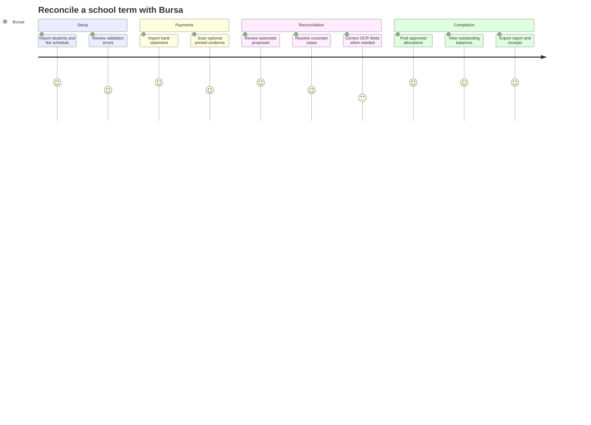

# Bursa Offline Reconciliation Copilot — Product Requirements Document

**Document status:** Approved product baseline  
**Version:** 1.0  
**Last updated:** 23 July 2026  
**Prepared for:** Bursa team, including Fikayo  
**Target programme:** Africa Deep Tech Challenge 2026 — Laptop LLM Challenge

## 1. Product Summary

### One-line pitch

**Bursa is an offline AI reconciliation copilot that converts messy bank statements and printed payment evidence into an accurate, auditable student-fee ledger on an ordinary school laptop.**

### Expanded pitch

Bursa uses a locally running language model, deterministic matching rules, offline OCR, and a financial constraint engine to reconcile ambiguous school-fee payments. It handles instalments, sibling payments, unclear narrations, duplicates, underpayments, and overpayments without banking APIs, cloud AI, or continuous internet access.

### Product category

- Offline enterprise productivity
- School financial operations
- Local language AI
- Document intelligence
- Human-in-the-loop financial reconciliation

## 2. Problem

Many Nigerian and African schools collect fees into one or more shared bank accounts. Bursars must manually determine which student each transfer belongs to.

The records are difficult to reconcile because:

- Parents use their own names rather than student names.
- Parents use nicknames, initials, abbreviations, or incomplete narrations.
- One parent may pay for several children in a single transfer.
- Students may pay in several instalments.
- Payments may combine tuition, books, uniforms, transport, and other fee items.
- Bank statements, teller slips, POS receipts, screenshots, and cash records arrive in different formats.
- Duplicate screenshots or transfers may be presented.
- Schools may have limited connectivity and cannot depend on cloud services.

The result is delayed reconciliation, disputed balances, incorrect receipts, revenue leakage, and repeated manual work every term.

## 3. Product Opportunity

Bursa removes dependence on a particular bank or payment provider. It works with the records schools already have:

- Student and fee registers
- Downloaded bank statements
- Printed receipts
- Teller slips
- Transfer screenshots
- Confirmed cash-payment records

This provider-agnostic position broadens Bursa from a payment integration into a reusable financial-operations product.

## 4. Hackathon Alignment

### Primary track

Corporate / Enterprise

### African problem context

Bursa addresses fragmented payment records, limited banking integration, inconsistent connectivity, and privacy-sensitive student data in African schools.

### Cross-disciplinary integration

The load-bearing pairing is:

- Local language model inference
- Accounting and financial constraint solving

Offline OCR adds document intelligence as a secondary integration.

### Why the LLM is load-bearing

Rules can match an exact student ID. They struggle with:

- `CHI AND SOMTO SCH FEE`
- `Tobi remaining 35k`
- `school fees for my pikin`
- A guardian surname that differs from the student's surname
- A lump sum matching two siblings' balances
- OCR-corrupted names and references

The local model interprets intent and ranks plausible candidates. The product cannot reconcile these ambiguous cases as effectively using rules alone.

## 5. Goals

### Product goals

1. Reconcile a complete demonstration term from imported local records.
2. Reduce manual work while maintaining financial safety.
3. Explain every proposed match.
4. Surface uncertainty rather than hiding it.
5. Produce an auditable per-student ledger.
6. Work offline on an 8 GB laptop.
7. Support printed payment evidence through offline OCR.
8. Demonstrate meaningful Nigerian Pidgin and selected African-language narration understanding.

### Hackathon goals

1. Stay below 7 GB peak RAM.
2. Achieve competitive reconciliation accuracy with a small quantized model.
3. Maintain usable CPU inference speed.
4. Avoid thermal throttling and temperatures above 85°C.
5. Submit a reproducible public repository and GGUF model.
6. Present a compelling two-minute end-to-end demonstration.

## 6. Non-Goals

The MVP does not include:

- Payment collection or virtual account provisioning
- Bank or fintech API integrations
- Refund or transfer initiation
- Parent SMS or email notifications
- Parent-facing portal
- Full school accounting, payroll, or expense management
- Reliable handwriting recognition
- Cloud deployment as a production dependency
- Automatic posting of uncertain matches
- General-purpose chatbot functionality
- Unrestricted natural-language-to-SQL

These may be considered after the hackathon if the reconciliation core succeeds.

## 7. Users and Jobs to Be Done

### Primary persona: School bursar

**Context:** Manages fee records, bank statements, receipts, and parent disputes.

**Jobs:**

- Import a new bank statement.
- See which transactions match students confidently.
- Resolve ambiguous payments quickly.
- Identify students who still owe.
- Explain why a student was marked as paid or unpaid.
- Produce an accurate class or term report.

### Secondary persona: School administrator or proprietor

**Jobs:**

- See total billed, collected, outstanding, credited, and unapplied amounts.
- Audit reconciliation decisions.
- Review unresolved transactions and exceptions.
- Confirm that the ledger balances with received payments.

### Supporting persona: Parent or guardian

The parent does not need an MVP login. The bursar should be able to search the parent's payment and generate a clear receipt or balance explanation.

## 8. Core User Journey

## 9. MVP Scope

### P0 — Required for a credible submission

1. Student and guardian import
2. Fee schedule import
3. Bank statement CSV import and column mapping
4. Canonical transaction normalization
5. Duplicate detection
6. Deterministic exact-match path
7. Local LLM reconciliation for ambiguous transactions
8. Financial constraint validation
9. Confidence-based automatic, review, and unmatched queues
10. Bursar approval and correction
11. Append-only student ledger
12. Underpayment, instalment, sibling split, and overpayment handling
13. Per-student and per-class balances
14. Reconciliation audit trail
15. Offline operation
16. ADTC profiler-compatible GGUF packaging

### P1 — Include after P0 is stable

1. Offline OCR for printed receipts and transfer screenshots
2. Evidence-to-bank-transaction linking
3. Restricted natural-language reporting
4. Receipt generation
5. Nigerian Pidgin reconciliation cases
6. Selected, human-reviewed Yoruba, Hausa, or Igbo cases

### P2 — Post-hackathon

1. Additional bank import templates
2. Controlled local network access for multiple bursars
3. Encrypted backups and restore workflow
4. Parent communication
5. Optional integrations with banks or payment providers
6. Full accounting exports
7. Mobile capture companion

## 10. Functional Requirements

### FR-001: School dataset setup

The bursar shall import students, guardians, sibling relationships, classes, terms, and fee schedules from CSV.

**Acceptance criteria:**

- Required-column validation occurs before records are saved.
- Duplicate student IDs are rejected.
- Amounts are parsed as exact NGN decimals and stored internally as integer minor units.
- Invalid rows are reported with row number and reason.
- A corrected file can be imported without duplicating valid existing records.

### FR-002: Bank statement import

The bursar shall import a CSV statement and map source columns to Bursa fields.

**Acceptance criteria:**

- The required fields are date, amount, transaction direction, and a reference or stable source identifier.
- Narration and payer name are imported when present.
- Debit rows are excluded from fee-receipt reconciliation.
- Re-importing the same file does not duplicate transactions.
- The import summary reports accepted, rejected, and duplicate rows.

### FR-003: OCR evidence import

The bursar shall upload or capture a printed receipt, teller slip, or transfer screenshot.

**Acceptance criteria:**

- OCR runs without a network connection.
- The original image is retained locally.
- Extracted amount, date, reference, payer, and narration can be corrected.
- Low-confidence critical fields are visibly marked.
- OCR evidence is not treated as confirmed bank receipt without a statement match or explicit bursar classification.

### FR-004: Deterministic reconciliation

Bursa shall resolve safe, unambiguous cases before invoking the LLM.

**Acceptance criteria:**

- Exact student IDs and transaction references can trigger deterministic proposals.
- Duplicate references are blocked.
- Every rule-generated proposal includes machine-readable reason codes.
- Ambiguous cases are escalated rather than forced.

### FR-005: AI-assisted reconciliation

Bursa shall invoke the local GGUF model for ambiguous transactions.

**Acceptance criteria:**

- Inference uses `llama.cpp`.
- No inference request leaves the laptop.
- The model receives no more than five candidate students.
- Output conforms to the reconciliation JSON schema.
- Invalid output cannot reach the ledger.
- The response includes candidate allocations, reason codes, an explanation, and ambiguities.

### FR-006: Financial constraint validation

Bursa shall validate every proposed allocation.

**Acceptance criteria:**

- Allocations cannot exceed the transaction amount.
- Allocations cannot reference unknown student or fee IDs.
- The same transaction cannot be posted twice.
- An unapplied remainder is preserved and visible.
- Excess student funds are recorded as credit.
- Any invariant failure routes the transaction to review.

### FR-007: Confidence and review

Bursa shall classify reconciliation results into high-confidence, review, and unmatched bands.

**Acceptance criteria:**

- Confidence is calculated from observable system features, not solely from model self-confidence.
- Medium-confidence transactions require bursar action.
- Low-confidence transactions remain unmatched.
- The reviewer can accept, edit, split, or reject a proposal.
- The original proposal remains in the audit history.

### FR-008: Instalments and underpayments

Bursa shall combine multiple confirmed payments against a student's fee balance.

**Acceptance criteria:**

- Each transfer remains a separate transaction.
- The ledger shows the sum allocated to the student.
- The remaining balance is calculated exactly.
- The student's status can be `outstanding`, `part_paid`, `cleared`, or `credit`.

### FR-009: Sibling and multi-student payments

Bursa shall support one transaction allocated across multiple students.

**Acceptance criteria:**

- All child allocations sum to no more than the transaction amount.
- Each allocation records its evidence and approval.
- A residual amount remains unapplied or becomes guardian credit according to an explicit bursar decision.

### FR-010: Overpayment

Bursa shall preserve excess funds as credit.

**Acceptance criteria:**

- Credit is recorded separately from billed fees.
- The interface clearly distinguishes `cleared` from `credit`.
- Credit can be applied to another approved fee item through a new ledger event.
- Historical entries are not overwritten.

### FR-011: Duplicate handling

Bursa shall detect repeated records and evidence.

**Acceptance criteria:**

- Duplicate transaction references cannot be posted.
- Re-importing a statement is idempotent.
- Multiple images linked to the same transaction remain evidence, not additional money.
- Possible duplicates without an exact reference appear in the review queue.

### FR-012: Ledger and audit trail

Bursa shall maintain an append-only business-event history.

**Acceptance criteria:**

- Every posting records actor, time, source transaction, allocation, evidence, and decision path.
- Corrections create reversal and replacement events.
- The system can reconstruct a student's balance from ledger events.
- Total allocated, credited, and unapplied amounts reconcile with imported credit transactions.

### FR-013: Dashboard and reports

Bursa shall show the reconciliation state of the current term.

**Acceptance criteria:**

- Dashboard totals include billed, received, allocated, outstanding, credited, and unapplied.
- Users can filter by class, term, status, and confidence band.
- Each student view shows charges, payments, credits, and outstanding balance.
- Reports display amounts in naira.

### FR-014: Natural-language reporting

Bursa may allow the bursar to ask approved financial questions locally.

**Acceptance criteria:**

- The model emits only the restricted report DSL.
- The backend maps valid requests to predefined parameterized queries.
- Unsupported questions are refused or redirected.
- The model cannot emit or execute arbitrary SQL.
- Answers link back to the underlying records.

### FR-015: Offline operation

Bursa shall complete all core workflows without internet access.

**Acceptance criteria:**

- Imports, OCR, inference, review, ledger posting, and reporting work with networking disabled.
- The application makes no external inference or telemetry request.
- A fresh evaluator can download the model before entering the offline evaluation window.

## 11. Business Rules

1. A bank credit transaction represents received money; a receipt image alone represents evidence.
2. A payment may have zero, one, or several student allocations.
3. A payment can remain partly or fully unapplied.
4. A student's fee status derives from ledger totals, not a manually edited status field.
5. Overpayment creates credit.
6. A duplicate reference never creates new value.
7. Automatic match is a reversible proposal subject to configured policy.
8. Medium- and low-confidence proposals cannot post without human action.
9. Money is displayed in naira and calculated internally using exact integer minor units.
10. No financial history is destructively edited.

## 12. Information Architecture and Screens

### 12.1 Setup

- School profile
- Academic session and term
- Student import
- Guardian and sibling import
- Fee schedule import

### 12.2 Import centre

- Bank statement upload
- Column mapping
- Import validation
- OCR evidence upload
- Import history

### 12.3 Reconciliation workspace

- Automatic proposals
- Needs-review queue
- Unmatched queue
- Duplicate warnings
- Side-by-side transaction, evidence, candidates, and explanation

### 12.4 Student ledger

- Charges
- Allocated payments
- Reversals
- Credits
- Outstanding balance
- Supporting evidence

### 12.5 Reports

- Term summary
- Class summary
- Outstanding students
- Unapplied payments
- Reconciliation audit
- Natural-language report input, if P1 is complete

## 13. User Experience Principles

- Show the source evidence beside every AI recommendation.
- Use plain financial language rather than model terminology.
- Make uncertainty visually obvious.
- Require the minimum number of clicks for repetitive review.
- Never hide unapplied money.
- Never imply that OCR evidence proves receipt of funds.
- Explain why a match was suggested.
- Display naira consistently.
- Allow correction without erasing history.

## 14. Non-Functional Requirements

### Performance

- Target total peak RAM below 5 GB.
- Remain below the 7 GB competition ceiling.
- Process deterministic matches without model inference.
- Run one model reconciliation at a time by default.
- Keep model prompts near or below 4,096 tokens.

### Reliability

- Statement import must be idempotent.
- Ledger invariants must be enforced transactionally.
- A model or OCR failure must not corrupt imported records.
- Interrupted batch processing must resume safely.

### Privacy

- All MVP data remains on the local laptop.
- No external analytics or crash reporting is enabled during evaluation.
- Training data is fictional or irreversibly de-identified.
- Logs redact sensitive student and guardian fields.

### Security

- Imported files are treated as untrusted.
- Narrations cannot override system instructions.
- Model outputs are schema-validated.
- Database queries are parameterized.
- Uploaded file types and sizes are restricted.

### Accessibility

- Core workflows are keyboard accessible.
- Status is represented by text and icons, not colour alone.
- Tables have clear labels and exportable equivalents.

## 15. Success Metrics

### Primary

- Zero incorrect automatic ledger postings on the gold evaluation set
- Zero ledger imbalance
- Zero duplicate posting
- At least 99.5% structurally valid model output
- Peak RAM below 7 GB
- No thermal penalty during official-style profiling

### Secondary

- Top-1 candidate accuracy
- Exact allocation accuracy
- Correct abstention rate
- Percentage reconciled without human intervention
- Median time to review an ambiguous payment
- Accuracy on Nigerian Pidgin and selected-language subsets
- Tokens per second and end-to-end latency

Numerical model-accuracy targets beyond structural validity will be fixed only after the first representative baseline dataset is evaluated.

## 16. Required Demonstration Scenarios

The demo dataset must show:

1. Exact student ID match
2. Parent name differing from student surname
3. Student nickname in narration
4. Underpayment
5. Several instalments
6. One transfer for two siblings
7. Overpayment becoming credit
8. Duplicate transaction or duplicate evidence
9. OCR import from a transfer screenshot
10. Unmatched payment
11. Ambiguous payment requiring bursar review
12. Nigerian Pidgin or selected African-language narration
13. Natural-language outstanding-balance question, if P1 is complete

The demonstration must include unhappy paths rather than only clean transactions.

## 17. Two-Minute Demo Narrative

1. **Problem:** Show a shared bank statement and an inaccurate manual spreadsheet.
2. **Import:** Load the student register, fee schedule, and statement with networking disabled.
3. **Fast path:** Bursa immediately reconciles clear transactions.
4. **AI value:** Open an ambiguous sibling payment and show the local model's proposed split and evidence.
5. **OCR:** Import a printed transfer screenshot and link it to a statement transaction.
6. **Safety:** Show an uncertain case routed to review rather than incorrectly posted.
7. **Outcome:** Display accurate student balances, unapplied money, and the audit trail.
8. **Proof:** Show profiler results for RAM, speed, and offline execution.

## 18. Delivery Phases

### Phase 1: Financial core

- Canonical data model
- CSV imports
- Exact matching
- Constraint engine
- Append-only ledger
- Basic reconciliation UI

### Phase 2: Model baseline

- Candidate generator
- Prompt and schema
- Qwen3-1.7B baseline
- Evaluation harness
- Human-review flow

### Phase 3: Domain adaptation

- Gold dataset
- LoRA fine-tuning
- GGUF conversion and quantization
- Confidence calibration
- Pidgin and selected-language evaluation

### Phase 4: OCR and reporting

- Printed evidence OCR
- Evidence linking
- Restricted report DSL
- Receipts and exports

### Phase 5: Hardening and submission

- Offline packaging
- Idempotency and recovery tests
- Resource and thermal profiling
- Documentation
- Demo video
- Submission prompts

## 19. Risks

| Risk | Product response |
|---|---|
| Team spends too long training before the ledger works | Build financial core and baseline inference first |
| Model performs arithmetic incorrectly | Constraint engine owns all arithmetic |
| OCR demo becomes unreliable | Use clearly printed documents and provide correction UI |
| Natural-language reporting expands scope | Keep it P1 and use only a restricted DSL |
| African-language support is not reviewed well | Claim only languages with competent human review |
| Automatic matches create financial harm | Calibrate conservatively and prefer review |
| App exceeds RAM limit | Use 1.7B baseline, short context, serial OCR, and profiler gates |
| Hidden prompts differ from visible examples | Train broad task families and preserve a true held-out test set |

## 20. Release Criteria for Hackathon Submission

The submission is ready only when:

- The application runs offline on the target profile.
- The required GGUF model downloads through the repository script.
- `llama.cpp` inference succeeds from a clean environment.
- Peak RAM remains below 7 GB in repeated profiler runs.
- No ledger invariant can be bypassed through model output.
- Required demo scenarios have automated or repeatable fixtures.
- The gold test set has no incorrect automatic postings.
- The public repository contains no student personal data or model weights.
- The report documents real benchmark results and known limitations.
- The two-minute video shows a working prototype.

## 21. References

- [Africa Deep Tech Challenge 2026](https://africadeeptech.org/challenge-2026/)
- [ADTC 2026 official rules](https://adtc-2026.devpost.com/rules)
- [ADTC 2026 submission template](https://github.com/Africa-Deep-Tech-Foundation/adtc-2026-submission-template)
- [ADTC profiler](https://github.com/Africa-Deep-Tech-Foundation/adtc-profiler)
- [Bursa model architecture](./MODEL_ARCHITECTURE.md)

