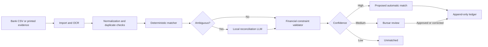

# Bursa Project Context

**Last updated:** 23 July 2026  
**Audience:** All Bursa collaborators, including Fikayo  
**Purpose:** Provide enough shared context to make consistent product, model, and implementation decisions without revisiting the original Nomba concept.

## 1. What We Are Building

Bursa is an offline AI reconciliation copilot for African schools.

It imports school fee records and bank statements, interprets messy payment narrations, proposes student-payment matches, validates allocations, and maintains an auditable per-student ledger. It can also use offline OCR to read printed receipts, teller slips, and transfer screenshots.

### Current one-line pitch

> Bursa is an offline AI reconciliation copilot that converts messy bank statements and printed payment evidence into an accurate, auditable student-fee ledger on an ordinary school laptop.

### Technical one-line pitch

> Bursa combines a locally running language model with deterministic matching, offline OCR, and financial constraint solving to reconcile instalments, sibling payments, unclear narrations, duplicates, underpayments, and overpayments without banking APIs or cloud AI.

## 2. Why the Product Changed

Bursa was originally designed for a Nomba hackathon:

- Each student would receive a Nomba virtual account.
- Webhooks would identify inbound payments.
- Nomba transaction and transfer APIs would support verification and refunds.

The current team will not have access to Nomba's APIs, and the Africa Deep Tech Challenge requires the core model to work offline without cloud dependencies.

The product has therefore moved from **payment collection** to **payment reconciliation**.

This is not a weaker fallback. It makes Bursa:

- Independent of banks and payment providers
- Useful to schools with existing shared accounts
- Compatible with historical records
- More privacy-preserving
- Better aligned with offline laptop inference
- Focused on the hardest part of the original problem

## 3. The Core Problem

Schools receive payments with incomplete and inconsistent information:

- A parent's name instead of a student's name
- Nicknames, initials, and spelling mistakes
- One transfer for several siblings
- Several instalments for one student
- One payment for several fee items
- Printed teller slips and POS receipts
- Transfer screenshots
- Duplicate or missing references
- Cash and electronic records maintained separately

Bursars manually compare these records with student spreadsheets. This causes delays, disputed balances, incorrect receipts, unapplied money, and revenue leakage.

## 4. Agreed Product Direction

The agreed direction is **offline reconciliation copilot**.

### Primary input

- Student and guardian CSV
- Fee schedule CSV
- Bank statement CSV

### Secondary input

- Printed receipt
- Teller slip
- POS receipt
- Transfer screenshot
- Printed bank-statement page

### Primary output

- Proposed payment-to-student allocations
- Human-review queue
- Unmatched-payment queue
- Per-student fee ledger
- Outstanding, part-paid, cleared, and credit status
- Reconciliation audit trail

### Secondary output

- Receipts and reports
- Restricted natural-language queries

## 5. Approved Architecture



### Important boundaries

- OCR transcribes documents; it does not reconcile them.
- The LLM interprets ambiguity; it does not control the ledger.
- The constraint engine validates money and IDs.
- The bursar resolves uncertain cases.
- The bank statement is the source of truth for received electronic payments.
- Receipt images are evidence until linked to a bank transaction or explicitly classified by the bursar.

## 6. Model Decision

### Initial baseline

Qwen3-1.7B, fine-tuned into `Bursa-Recon-1.7B`.

### Required runtime

- `llama.cpp`
- GGUF weights
- CPU inference
- Offline execution
- Constrained JSON output

### Quantization candidates

- Q4_K_M
- Q5_K_M

Selection will be based on reconciliation accuracy, tokens per second, peak RAM, and thermal behaviour.

### What the model does

1. Extracts meaning from messy narration.
2. Ranks up to five candidate students.
3. Predicts payment-allocation intent.
4. Explains evidence and ambiguity.
5. Abstains when evidence is insufficient.

### What the model does not do

- Invent IDs
- Modify balances
- Post to the ledger
- Execute SQL
- Verify that money reached the bank
- Override financial invariants

## 7. OCR Decision

OCR is included as a secondary MVP input after core CSV reconciliation is stable.

### Supported initially

- Clear printed teller slips
- POS receipts
- Transfer screenshots
- Printed statement pages

### Not promised initially

- Reliable handwriting recognition

### Initial tool

Tesseract or another lightweight offline engine selected after a small device benchmark.

The user can inspect and correct extracted fields. Low-confidence amount, reference, and date fields must be highlighted.

## 8. Money Representation

Bursa is a naira-based product.

- Users enter and see amounts in naira.
- CSVs use naira decimal values.
- Reports and receipts display `₦`.
- The ledger stores integer minor units internally for exact arithmetic.

Example:

```text
Displayed: ₦75,000.00
Stored internally: 7,500,000 minor units
Currency: NGN
```

The internal representation prevents floating-point rounding errors. The term `amount_minor` is preferred over exposing `amount_kobo` throughout the product.

## 9. Financial Rules That Must Never Be Broken

1. Allocations cannot exceed the transaction amount.
2. Transaction references cannot be posted twice.
3. Only known student and fee IDs may be allocated.
4. Unallocated money remains visible.
5. Overpayment becomes credit.
6. Reversals preserve history.
7. Floating-point arithmetic is not used for money.
8. Medium- and low-confidence results require human action.
9. Model or OCR failure cannot post financial records.
10. Every posting retains its source, evidence, actor, and decision path.

## 10. Hackathon Constraints

The system must:

- Run on Ubuntu 22.04
- Target Intel Core i5 10th–12th generation
- Use 8 GB RAM
- Use integrated graphics only
- Stay below 7 GB peak RAM
- Run 100% offline during evaluation
- Use `llama.cpp`
- Package model weights as GGUF
- Avoid crashes and out-of-memory events
- Avoid CPU temperatures above 85°C and thermal throttling

The scoring emphasis is approximately:

- 50% accuracy and quality
- 30% speed
- 20% efficiency
- Thermal penalty when applicable

The repository must follow the official ADTC submission template.

## 11. MVP Priorities

### Build first

1. Canonical student, fee, transaction, and ledger data model
2. Student and fee CSV import
3. Bank statement CSV import
4. Duplicate detection
5. Deterministic matching
6. Financial constraint engine
7. Append-only ledger
8. Review and unmatched queues
9. Local baseline model
10. Evaluation harness

### Build next

1. Fine-tuned model
2. Confidence calibration
3. OCR
4. Pidgin and selected African-language cases
5. Restricted natural-language reporting
6. Receipts and exports

### Do not build for the hackathon

- Payment APIs
- Virtual accounts
- Refund transfers
- Parent portal
- SMS and email notifications
- Full school ERP
- Payroll or expenses
- Cloud-dependent services
- General-purpose chatbot

## 12. Required Demo Cases

The shared demo dataset must include:

1. Clean exact match
2. Guardian name differing from student surname
3. Nickname or misspelling
4. Underpayment
5. Multiple instalments
6. Sibling split
7. Overpayment and credit
8. Duplicate transaction
9. Duplicate receipt image
10. OCR transfer screenshot
11. Unmatched payment
12. Ambiguous case requiring review
13. Pidgin or selected African-language narration

## 13. Success Definition

Bursa succeeds when it demonstrates that an ordinary school laptop can:

- Reconcile a realistic term offline
- Resolve difficult narrations more accurately than rules alone
- Produce no incorrect automatic ledger postings on the gold evaluation set
- Keep the ledger balanced
- Explain each AI-assisted decision
- Stay below the hardware limits
- Give a bursar a faster, safer workflow

The product should prefer an honest `needs review` result over a confident but incorrect match.

## 14. Team Working Agreements

When making a new product or technical decision:

1. Check whether it strengthens core reconciliation.
2. Check whether it works without internet access.
3. Check its RAM, latency, and thermal cost.
4. Keep LLM responsibilities separate from ledger responsibilities.
5. Add a test case for every new reconciliation behaviour.
6. Document any change to the approved financial invariants.
7. Keep personally identifiable school data out of the public repository.
8. Measure claims before placing them in the final report.

## 15. Current Open Engineering Questions

These questions require experiments, not assumptions:

1. Does Qwen3-1.7B outperform Gemma 3 1B and Llama 3.2 3B on Bursa's gold set?
2. Does Q4_K_M retain enough allocation accuracy, or is Q5_K_M worth the resource cost?
3. What CPU thread count gives the best speed without thermal throttling?
4. Which OCR preprocessing steps provide the best accuracy on Nigerian transfer screenshots?
5. What calibrated confidence threshold produces zero incorrect automatic postings?
6. How many realistic, human-reviewed examples are needed before LoRA improves the baseline?

These are not product ambiguities. Each has a defined benchmark and should be resolved during implementation.

## 16. Canonical Documents

- [Product requirements](docs/PRD.md)
- [Model architecture](docs/MODEL_ARCHITECTURE.md)
- [Africa Deep Tech Challenge 2026](https://africadeeptech.org/challenge-2026/)
- [Official rules](https://adtc-2026.devpost.com/rules)
- [Submission template](https://github.com/Africa-Deep-Tech-Foundation/adtc-2026-submission-template)
- [Profiler](https://github.com/Africa-Deep-Tech-Foundation/adtc-profiler)

